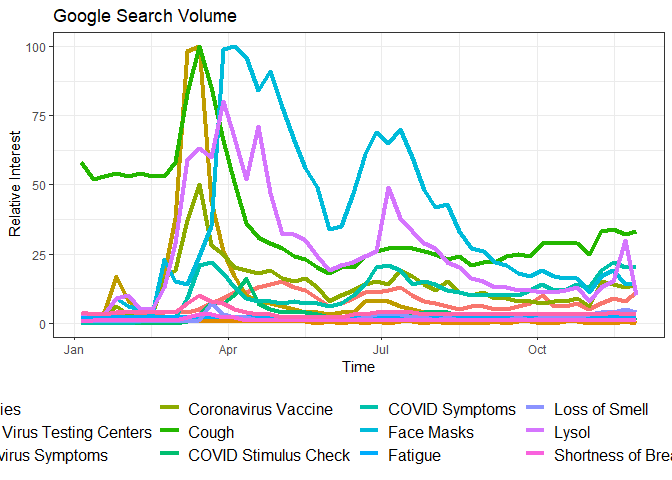
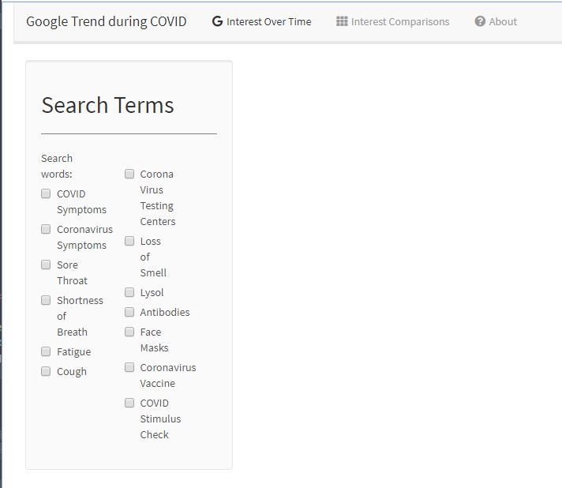
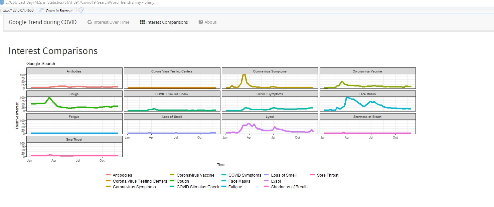

Google Search Trend During COVID Pandemic : Report
================
Zhaoshan Duan
December 11, 2020

# Introduction

Google Trends data are used by researchers from medical research to
economy forecasting. In this project, we are interested in looking at
American Google users’ search behavior during the COVID-19 Pandemic with
the goal of understanding what aggregated search behavior can reveal
about how public interests shifts as an unprecedented international
event unfolds.

As of December 2020, United States has the highest COVID-19 cases around
the world. Along with Google having a 88.14% search engine market share
in the country, the U.S. is a prime candidate for COVID-related studies
and aggregated search behavior.

This project focuses on developing an interactive Shiny application that
allow users to visualize over time interest on **13 COIVD-related search
words** that may be perceived to be popular.

# Workflow

The workflow of the project is guided by four questions:

-   How to identify the Search Words ?
-   How to wrangle the data ?
-   How to do the visualization?
-   How to present the product ?

## How to identify the Search Words ?

Depending on the subject of interests, we first were going to study
queries and leading questions that are board and general. [This
project](https://searchingcovid19.com/) by Google Trends, Schema and
Axios uses search queries that start with “What is/are …” and “How to
…”. However, as we discovered that queries like those are not all
COVID-related (due to U.S. domestic events such as “George Floyd
Protest” and “President Election” ), we shifted the focus on specific
search words and limited to 13 words.

The search words are

|                          |                          |                                  |                         |
|--------------------------|--------------------------|----------------------------------|-------------------------|
| **COVID Symptoms**       | **Coronavirus Symptoms** | **Sore Throat**                  | **Shortness of Breath** |
| **Fatigue**              | **Cough**                | **Corona Virus Testing Centers** | **Loss of Smell**       |
| **Lysol**                | **Antibodies**           | **Face Masks**                   | **Coronavirus Vaccine** |
| **COVID Stimulus Check** |                          |                                  |                         |

## How to wrangle the data ? (Method)

### Data

Google Trends is a well-known, free tool provided by Google that allows
users to analyze the popularity of top search queries on its Google
search engine. The project is using its `gtrendR` package to retrieve
data from January 01, 2020 to December 01, 2020. We are interested in
the popularity of certain key words such as “COVID Symptoms” over time.

Data are retrieved and processed in the R script file `wrangle.R` and
generates an object `trend` for the shiny application to visualize.

``` r
source("./shiny/wrangle.R")
```

The final data frame has three variables: `date`, `hits`, `keyword` ,
with 624 observations.

``` r
names(trend)
```

    ## [1] "date"    "hits"    "keyword"

``` r
head(trend,6)
```

    ##         date hits        keyword
    ## 1 2020-01-05  0.0 COVID Symptoms
    ## 2 2020-01-12  0.0 COVID Symptoms
    ## 3 2020-01-19  0.0 COVID Symptoms
    ## 4 2020-01-26  0.0 COVID Symptoms
    ## 5 2020-02-02  0.0 COVID Symptoms
    ## 6 2020-02-09  0.5 COVID Symptoms

``` r
tail(trend,6)
```

    ##           date hits              keyword
    ## 619 2020-10-25    2 COVID Stimulus Check
    ## 620 2020-11-01    1 COVID Stimulus Check
    ## 621 2020-11-08    2 COVID Stimulus Check
    ## 622 2020-11-15    2 COVID Stimulus Check
    ## 623 2020-11-22    1 COVID Stimulus Check
    ## 624 2020-11-29    2 COVID Stimulus Check

`date` and `keyword` respectively represents the date and the search
word. This is what the `hits` variable represents, according to
[Google’s FAQ
documentation](https://support.google.com/trends/answer/4365533?hl=en):

> Google Trends normalizes search data to make comparisons between terms
> easier. Search results are normalized to the time and location of a
> query by the following process:

> Each data point is divided by the total searches of the geography and
> time range it represents to compare relative popularity. Otherwise,
> places with the most search volume would always be ranked highest.

> The resulting numbers are then scaled on a range of 0 to 100 based on
> a topic’s proportion to all searches on all topics.

## How to do the visualization? (Method)

This project uses a shiny web application to visualize the trend over
time. The app is composed of three tabs using a navigation bar.

Under the first tab **Interest Over Time** , comparisons of interests of
all the search words (13 of them) over time, like such:

``` r
ggplot(trend,aes(x=date, y=hits,group=keyword,col=keyword))+
            geom_line(size=1.5)+
            xlab('Time')+ylab('Relative Interest')+ theme_bw()+
            theme(legend.title = element_blank(),
                  legend.position="bottom",legend.text=element_text(size=12))+
            ggtitle("Google Search Volume") 
```

<!-- -->

The side panel of the page gives user options to plot certain amount of
keywords, all options are unchecked by default when the application
launches:



(Note: this feature crashes the program after R was updated to 4.0.2. I
can fix the bug with more time)

The second tab **Interest Comparisons** provides an overview of all the
search words over time, like such:



The third tab **About** provides general information about the project.

## Limitations of Google API

One major limitation of Google Trends is that we could only request a
query of maximum five terms at the same time. This limitation of the
package makes it difficult to visualize the data at scale.

We also need to note that since the searches are voluntary, each of
these searches was conducted for its own reason (exploring a topic,
clarifying a term, seeking evidence to bolster an argument). Therefore,
Google trends data are best used for observation but insufficient for
making causal conclusions.

We initially wanted to compare the trend with political affiliations. We
eventually decided to abandon the idea since it could be misleading due
to the nature of Google Trend data.

# Future Implementation

## shiny dashboard

It is better to visualize the data in a shiny dashboard.

## Sunburst Graph and Dynamicality

Originally, we were interested in visualizing the COVID data over time
through a **rotating sunburst graph** with color corresponding to that
of a COVID virus. This implementation was met with great technical
difficulties with making `D3` work with animation. Currently we are
uncertain about how to implement this feature in R.

# Reference and Acknowledgements

## Videos

*Correlations Between COVID-19 Cases & Google Trends Data in the US* -
Mayo Proceedinngs:

<a href="https://www.youtube.com/watch?v=vJTHNobkh18&amp;ab_channel=MayoProceedings" class="uri">&lt;https://www.youtube.com/watch?v=vJTHNobkh18&amp;ab_channel=MayoProceedings&gt;</a>

## Articles

<https://www.mayoclinicproceedings.org/article/S0025-6196(20)30934-4/fulltext>

# Design Reference

Design

<a href="https://fontawesome.com/icons?from=io" class="uri">&lt;https://fontawesome.com/icons?from=io&gt;</a>

<a href="https://www.washingtonpost.com/business/2020/04/17/last-year-we-searched-google-how-tie-tie-now-were-using-it-find-toilet-paper/?arc404=true" class="uri">&lt;https://www.washingtonpost.com/business/2020/04/17/last-year-we-searched-google-how-tie-tie-now-were-using-it-find-toilet-paper/?arc404=true&gt;</a>

Sunburst Diagram

<a href="https://datavizproject.com/data-type/sunburst-diagram/" class="uri">&lt;https://datavizproject.com/data-type/sunburst-diagram/&gt;</a>
